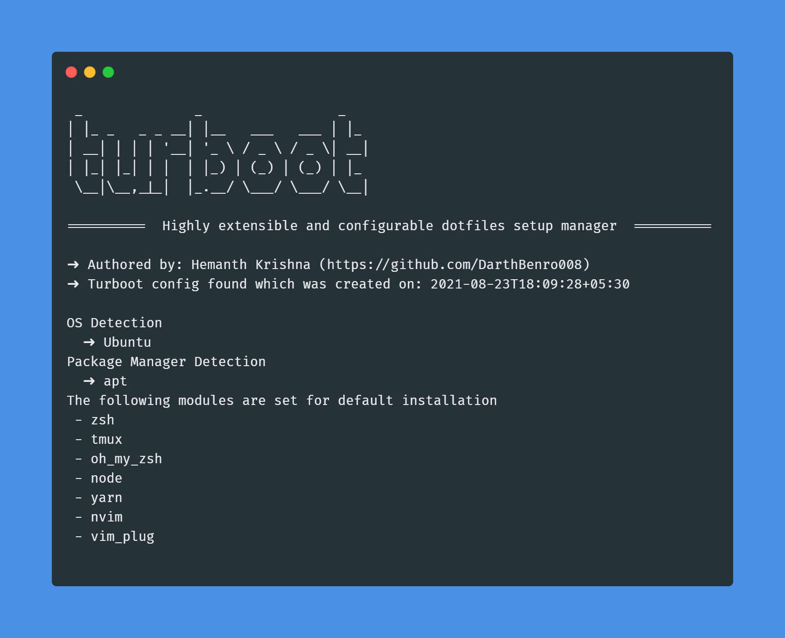

[](https://github.com/darthbenro008/turboot/blob/master/LICENSE)
[](https://img.shields.io/twitter/url?style=social&url=https%3A%2F%2Fgithub.com%2FDarthBenro008%2Fturboot)

# Turboot

> A highly extensible and configurable dotfiles manager

## 🤔 What is turboot?

If you relate to the following questions, turboot is for you!

- Do you distro hop frequently and spend a lot of time re-configuring your essential setup?
- Do you work a lot on VM instances and wish you could configure your dotfiles with a single commnd regardless of the distro?
- Do you want an easy way to unpack your dotfiles in new machine?

Well, as the name suggests, turboot is and one-click highly extensible dot-files manager that allows you set-up your dotfiles for any linux distro! (Arch/Debian/Fedora)

Place turboot in your dotfiles and you are good to go and rock!


  
## ⬇ Usage

- Clone the repository using `git clone https://github.com/DarthBenro008/turboot`
- Make sure to add your dotfiles, something similar to this:.

```bash
.
+-- .alacritty.yml
+-- nvim
|   +-- init.vim
+-- .p10.zsh
+-- .zshrc
+-- .turboot.sh
```

- Open up turboot using `vim tuboot.sh` or `nano tuboot.sh`
- Add the modules you would like to create in the `DEFAULT_MODS` array
- Now run `chmod +x turboot.sh && ./turboo.sh -g <YOUR PACKAGE MANAGER>`
- A file would with the name of `<Features PACKAGE MANAGER>.sh` would have been generated
- Open the file and complete the comments
- Run turboot using `./turboot.sh`
- Complete the prompt to install and configure your dotfiles!
- You can also add custom and default modules for your liking!
- Check the features of Turboot to learn more!

## 🎿 Features

### 🧱 Modularity

The way turboot works is concept of modules. Each package manager has its own file. For eg, apt has its own file named `apt.sh` , `dnf` has its own file named `dnf.sh` and these file contain Installtion instructions for the module you have defined in turboot.

You can tinker with the configs to your liking:

```bash
# Global Mods, this is where you define modules for turboot to detect
MODS=("zsh" "tmux" "oh_my_zsh" "node" "yarn" "nvim" "vim_plug" "python" "fzf") 
 # Default mods are those mods that get installed by default when turboot runs
DEFAULT_MODS=("zsh" "tmux" "oh_my_zsh" "node" "yarn" "nvim" "vim_plug") 
# Location to save your config file  
CONF_FILE="$HOME/.turbootrc"    
```

### ✍ Writting a Module/Generating Package Manager Template

As turboot works with modularity, if you want a module add it in the `MODS` section and then run `./turboot -g <YOUR PACKAGE MANAGER SHORTHAND>`, your package manager shorthand could be apt, dnf, pacman, yay or literally anything. 

Turboot will generate a file `<YOUR PACKAGE MANAGE SHORTHAND>.sh`, and you can populate the modules installation script. 

This is how it looks for `apt.sh` for the above given modules.

```bash
# Package Manager template for apt

install_zsh() {
    sudo apt-get install zsh
}

install_tmux() {
    sudo apt install tmux
}

install_oh_my_zsh() {
    sh -c "curl -fsSL https://raw.github.com/ohmyzsh/ohmyzsh/master/tools/install.sh"
}

install_p10k() {
    git clone --depth=1 https://github.com/romkatv/powerlevel10k.git ${ZSH_CUSTOM:-$HOME/.oh-my-zsh/custom}/themes/powerlevel10k
}

install_node() {
    curl -fsSL https://deb.nodesource.com/setup_16.x | sudo -E bash -
    sudo apt-get install -y nodejs
}

install_yarn() {
    sudo npm install --global yarn
}

install_nvim() {
    sudo apt install neovim
}

install_vim_plug() {
    sh -c 'curl -fLo "${XDG_DATA_HOME:-$HOME/.local/share}"/nvim/site/autoload/plug.vim --create-dirs \
       https://raw.githubusercontent.com/junegunn/vim-plug/master/plug.vim'
}

install_fzf() {
    sudo apt-get install fzf
}

```

Then you can create a new function name `install_<module name>(){}` and write the function for your module.

> NOTE: the module name should not contain spaces and should follow snake case system.

### 💪 Ability to automatically detect your distro and install your configs

- when you run turboot for the first time, it automatically detects your distro and stores it in `.turbootrc` file. You can change the OS and package manager settings either in the configs or turboot will ask if the configs are correct, you can simply press "n" and turboot will ask you for the right details.

### 🔗 Symlink Support

Modify the following to add your own symlink to your dotfiles!

```bash
create_symlinks() {
    # Creating Symlinks
    ln -sf $CWD/.alacritty.yml ~/.alacritty.yml
    ln -sf $CWD/nvim ~/.config/nvim
    ln -sf $CWD/.zshrc ~/.zshrc
    ln -sf $CWD/.p10k.zsh ~/.p10k
    e_success "Created symlinks to configs"
}
```


## 🤝 Contributions

- Feel Free to Open a PR/Issue for any feature or bug(s).
- Make sure you follow the [community guidelines](https://docs.github.com/en/github/site-policy/github-community-guidelines)!
- Feel free to open an issue to ask a question/discuss anything related to turboot.
- Have a feature request? Open an Issue!

## ⭐ Show your support

Give a ⭐ if this tool made your life easier!

Spread the word to your geek fellows to save thier time!

## ⚖ License

Copyright 2021 Hemanth Krishna

Licensed under MIT License : https://opensource.org/licenses/MIT

<p align="center">Made with ❤ and single cup of coffee</p>